# Deploy Network Slices

## 1. Introduction

The first objective of these labs is to check and get familiar with the tools that comprise the NFV architecture in the testbed and you will be using for deploying End-to-End virtual services: OpenStack, Open Source MANO, and Katana Slice Manager. You will first create a single OpenStack VM that will act as a client node in your network topology. Then, you will configure and instantiate an NS/VNF via the OSM, creating a part of the 5G service on a specific domain (i.e., the Edge). Finally, you will be called to configure the Katana Slice Manager and create two Network Slices that will establish the demo End-to-End 5G service.

### End-to-End demo 5G Slice

The first Slice will involve a demo 5G Core that will be deployed at the Core location of the testbed and a demo gNodeB that will be deployed at the demo edge location of the testbed and connected with your Client node. This Slice will allow the Client node to be connected to the Internet.

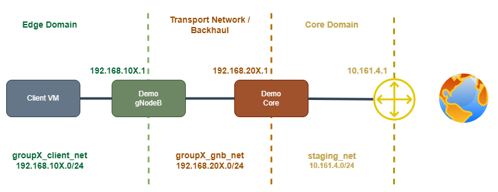

### End-to-End demo 5G Slice and Firewall

The second Slice will be similar to the first one, including an extra virtual Firewall. After creating the Slice and checking the connectivity of the Client node, you will run a Day-2 action on the Firewall, blocking any traffic from that node.

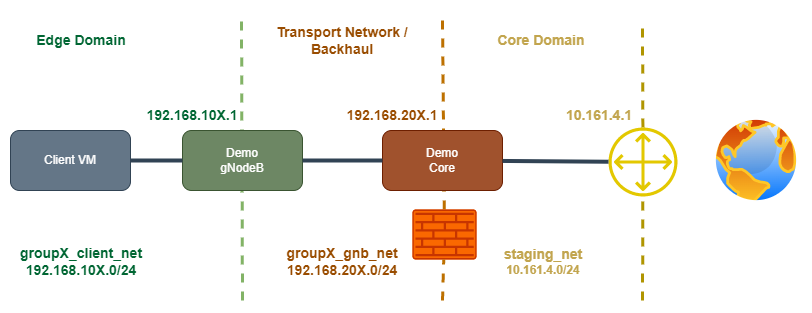

## 2. Prepare for the lab

> The credentials for all the tools will be provided to you during the lab session

### Download the lab's Github repository

Download the lab's repository and cd into the respective folder for your group:

```bash
git clone https://github.com/medianetlab/OuluLabs.git
cd OuluLabs/groupX
```

### Connect to the NCSRD premises 

Download your preferred client from the list below:

* Anyconnect 
  * [Windows](https://www.dropbox.com/s/x03or6v99xlckdy/anyconnect-client-win.msi?dl=0)
  * [MAC](https://www.dropbox.com/s/6augl8wn85umfuz/anyconnect-macosx-i386-3.1.00495-k9.dmg?dl=0)
* OpenConnect
  * [UNIX/MAC/LINUX](http://www.infradead.org/openconnect/) 

Point the client software at the gateway: `mnl-vpn.iit.demokritos.gr`

Use the credentials supplied to you during the lab session.

### Login to your group's tools

#### OpenStack

OpenStack is the Virtual Infrastructure Manager you will use to deploy Network Slices. Go to the OpenStack home page `http://10.161.0.11/horizon` and log into your account using your group's credential. Navigate around the various windows that present different OpenStack resource objects, such as virtual servers, virtual networks, images, etc.


#### Open Source MANO (OSM)

OSM is an ETSI-hosted project to develop an Open Source NFV Management and Orchestration (MANO) software stack aligned with ETSI NFV. It acts as an NFV Orchestrator (NFVO) in our testbed. Go to the OSM home page `http://10.161.5.155/projects/` and log in using your group's credential. Navigate around the various OSM windows to see the various stored VNFD and NSD packages.


#### Katana Slice Manager

You will find the Katana Slice Manager server that you will be using instantiated inside your group's instances on OpenStack. 

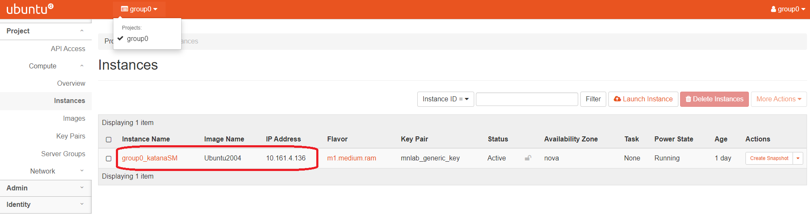

Copy the IP address of the VM hosting Katana and use it to open the Katana swagger page at `http://KATANA_IP:8001`. Check the various endpoints and resources supported by Katana.

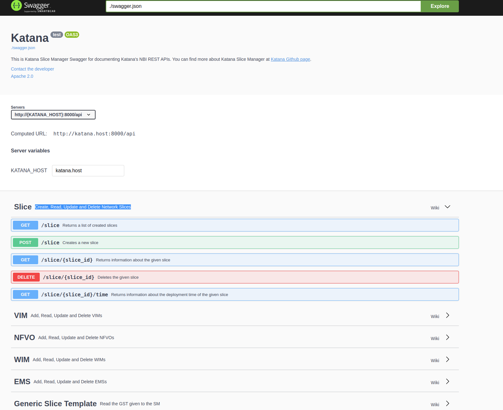

### Create the client VM

Create the VM that will be used as a client node for the demo 5G slices. On the OpenStack dashboard, go to the __Project/Compute/Instances__ window and click the __Launch Instance__ button located in the top-right corner. 

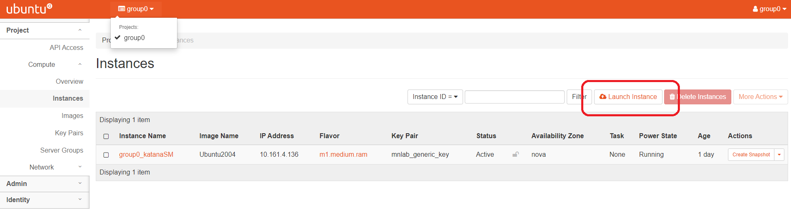

On the pop-up window, select the following properties for the new VM:

* Details/Instance Name: 
  * groupX_client
* Source:
  * ClientImage
* Flavor
  * m1.tiny
* Networks
  * groupX_client_net

Open the VM console and log in using the credentials: __Username: cirros__ - __Password: gocubsgo__. Check the IP address and the defined routes of the VM.

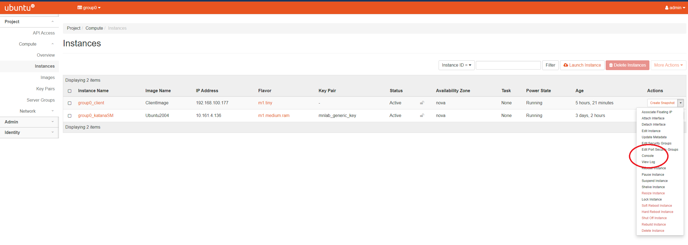

> OpenStack documentation: Launch and manage instances: https://docs.openstack.org/horizon/wallaby/user/launch-instances.html

## 3. Create a single Network Service (NS) via Open Source MANO

OSM allows us to create a virtual NS on a specific testbed domain (e.g., Core, Edge, etc.). In this example, you will create a demo gNodeB network service. Your client VM will be able to communicate with the new gNodeB, but it won't be able to reach any other network on the Internet since you will be missing the 5G Core part of the 5G service. The first step is to register the VIM that OSM will use for hosting the NS. Go to the __VIM Accounts__ window from the OSM dashboard and click the __New VIM__ button located in the top-right corner.

On the pop-up window, select the following properties for the new VIM:

* Name: DemoVIM
* Type: Openstack
* URL: http://10.161.0.11:5000/v3
* Tenant name: groupX
* Username: groupX
* Password: groupX

> OSM documentation: Adding VIMs through GUI: https://osm.etsi.org/docs/user-guide/v10/01-quickstart.html#adding-vims-through-gui

Next, open the __Instances/NS Instances__ window, and click the __New NS__ button located in the top-right corner to launch a new NS. You will use the demo gNodeB NSD to create a gNodeB instances.

On the pop-up window, select the following properties for the new NS:

* Name: demoNS
* Description: A new demo NS
* Nsdd Id: groupX_demoGnbnsd
* Vim Account Id: DemoVIM

You will see a new NS and VNF instantiating on the respective tabs. Go to the OpenStack dashboard and check the new VM starting as part of the gNodeB VNF. From your client VM console, you should be able to ping the default GW, but nothing else on the Internet. You may now delete the new NS using the OSM Dashboard.

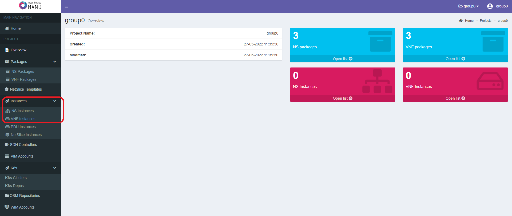

> OSM documentation: Instantiating an NS: https://osm.etsi.org/docs/user-guide/v10/01-quickstart.html#instantiating-the-ns

__Important__: Delete the NS before proceeding to the next step.

## 4. Create a simple 5G Slice via Katana Slice Manager

Katana Slice Manager enables the creation of end-to-end 5G Slices. You will use Katana to create a network slice that will include both demo 5G Core and demo gNodeB, allowing your client VM to connect to the Internet. Before creating any slices, you need to add to Katana the configuration files that describe your testbed's available components and services. From your terminal, cd into the Slice Manager and check the different configuration files:

```bash
cd sm
ls
```

### Register the available platform locations

The first step for the Katana administrator is to register the available testbed locations. These [locations](location) will be used at a later stage for registering platform components and, eventually, deploying network slices. In your case, you have a dummy edge location (not representing an actual location since all the services will be deployed within the same OpenStack instances). Add the edge location by running a curl against the Slice Manager location endpoint:

```bash
curl -X POST -H "Content-type: Application/json" http://KATANA_IP:8000/api/location -d '@location/groupX_edge.json'
```

You will get back the UUID of the new location. By default, Katana uses a default Core location for all Slices. Run a GET request to see all the available locations:

```bash
curl -X GET http://KATANA_IP:8000/api/location
```

### Register the available testbed components

Before starting using Katana for the creation of network slices, the Katana administrator has to execute some configuration steps:

*  Register MANO layer components:
    * __VIMs:__ Register the VIM  that will be used for hosting virtual network services instantiated as part of network slices (in your case, the OpenStack cloud):
    ```bash
    curl -X POST -H "Content-type: Application/json" http://KATANA_IP:8000/api/vim -d '@vim/groupX_openstack.json'
    # Check the registered VIMs
    curl -X GET http://KATANA_IP:8000/api/vim
    ```
    * __NFVOs:__ Register the NFVO that will be responsible for the management of the virtual network services (in your case, the Open Source MANO)
    ```bash
    curl -X POST -H "Content-type: Application/json" http://KATANA_IP:8000/api/nfvo -d '@nfvo/osm8.json'
    # Check the registered NFVOs
    curl -X GET http://KATANA_IP:8000/api/nfvo
    ```

    > Refer to [SBI Documentation Page](https://github.com/medianetlab/katana-slice_manager/wiki/sbi) for details regarding how to configure Southbound components

* Add the network functions (NSSIs) supported by the underlying platform infrastructure. These will be used during the Slice Mapping phase by the Slice Manager to map the slice requirements with the actual slices supported by the platform. For this setup, you will use two NSSIs, one representing the demo 5G Core and one the demo gNodeB.

```bash
curl -X POST -H "Content-type: Application/json" http://KATANA_IP:8000/api/function -d '@functions/demo5gcore.json'
curl -X POST -H "Content-type: Application/json" http://KATANA_IP:8000/api/function -d '@functions/demo5ggnb.json'
# Check the registered NSSIs
curl -X GET http://KATANA_IP:8000/api/function
```

> Refer to [NSSI Documentation Page](https://github.com/medianetlab/katana-slice_manager/wiki/function) for details regarding the NSSIs

### Create the Slice

To create a network slice, you must pass a NEtwork Slice Template (NEST) to Katana, calling the appropriate endpoint. Check the NEST file `nest/groupX_nest.json` that describes some core parameters of the Slice to be created, such as the coverage area (the demo edge location that you registered), sharing capabilities, QoS characteristics, etc. Use this NEST to create the first slice:

```bash
curl -X POST -H "Content-type: Application/json" http://KATANA_IP:8000/api/slice -d '@nest/groupX_nest.json'
# Check the status of the slice
curl -X GET http://KATANA_IP:8000/api/slice
```

Keep the id of the new slice, as you will need it later. Check the Slice status changing from Provisioning to Activation and finally Running. Then you should be able to see on the OpenStack Dashboard a newly created Tenant that includes the VMs necessary for supporting the Slice services.

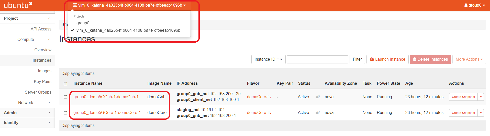

In addition to that, the OSM Dashboard will display the new Tenant VIM, as well as the NSs and VNFs that are instantiated as part of the Slice.

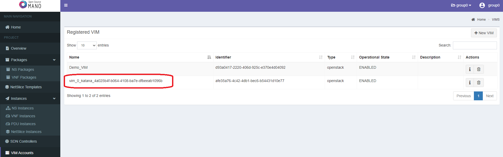

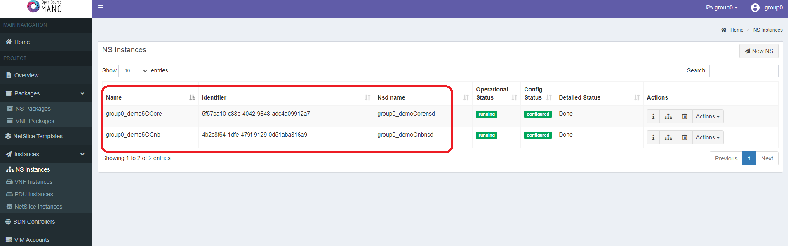

Go to the client VM console and check that you successfully ping a public IP Address, such as Google's DNS `8.8.8.8`.

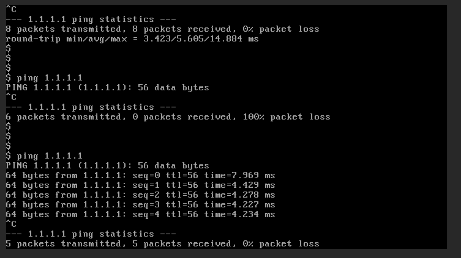

Finally, delete the Slice and verify that all the above resources are released:

```bash
curl -X DELETE http://KATANA_IP:8000/api/slice/<SLICE_ID>
```

## 4. Create a 5G Slice with an additional FW service

### Edit the NEST

The second Slice will include an extra virtual FW NS that will allow the Slice Manager or an external tool to perform security Day-2 operations. For this Slice you will use the NEST `__nest/groupX_nest_fw.json__`. You must open the file and edit it to include the FW NS in the __service_descriptor__ field. This field must comply with the following format:

```JSON
"service_descriptor": {
  "ns_list": [
    {
      "nsd-id": "", // The FW NSD id on the NFVO 
      "ns-name": "", // A descriptive name for the new NS
      "placement": 0, // 0: Core, 1: Edge
      "optional": false // Whether the NS is optional or not
    }
  ]
}
```

> You can check the full specification of the NEST model here: https://github.com/medianetlab/katana-slice_manager/blob/master/templates/gst_model.json

Create the Slice and wait for it to be in a running state:

### Create the Slice

```bash
curl -X POST -H "Content-type: Application/json" http://KATANA_IP:8000/api/slice -d '@nest/groupX_nest_fw.json'
# Check the status of the slice
curl -X GET http://KATANA_IP:8000/api/slice
```

You should be able to see again the new Tenant and VMs on OpenStack, as well as the instantiated NSs and VNFs on OSM. Note that an additional NS has been created using the FW NSD and the name that you specified on the NEST. Once again, go to the client VM console and check that you successfully ping a public IP Address, such as Google's DNS `8.8.8.8`.


### Perform a Day-2 action using the Firewall

In this final stage of this lab, you will use the deployed Firewall to perform a Day-2 action, blocking any traffic coming from the client node. For this purpose, you will use a script included in the Firewall VM. To do that, first, you need to get the IP address of the Firewall VM. On the OpenStack dashboard, select the new Slice tenant from the list located at the top-left corner of the window. Go to the tab __Project/Compute/Instances__ and get the IP address of the Firewall VM. From your terminal, execute the script located in the Firewall VM. The credentials for this VM are __Username: demo__ - __Password: demo__:

```bash
ssh demo@<FW_IP_ADDRESS> bash -c '/home/demo/block_client_traffic.sh'
```

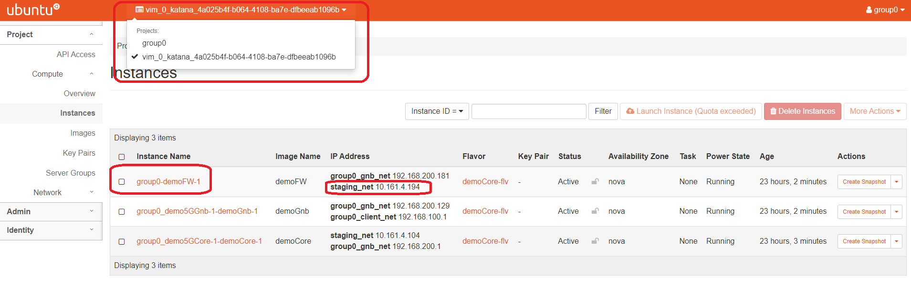

Check the internet connection on your Client VM again. You shouldn't be able to reach anything beyond the demo 5G Core instance.

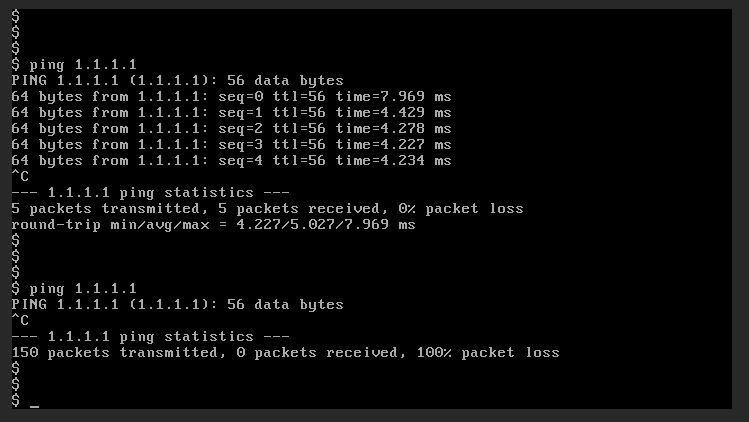

Finally, delete the Slice and verify that all the above resources are released:

```bash
curl -X DELETE http://KATANA_IP:8000/api/slice/<SLICE_ID>
```
