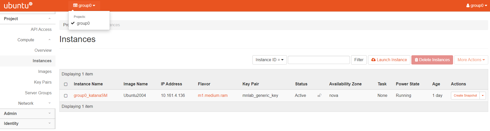
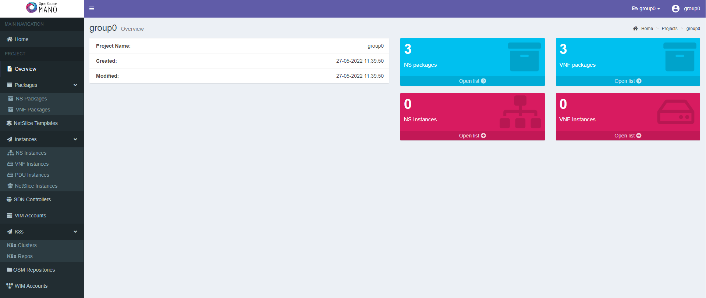

# Deploy Network Slices

## 1. Login to your group's tools

> The credentials for the group X are: **Username: groupX** - **Password: groupX**

### OpenStack

OpenStack is the Virtual Infrastructure Manager that you will use for deploying Network Slices. Go the OpenStack home page `http://10.161.0.11/horizon` and log into your account using your group's credential. Navigate around the various windows that present different OpenStack resource objects, such as virtual servers, virtual networks, images, etc.

### Open Source MANO (OSM)

OSM is an ETSI-hosted project to develop an Open Source NFV Management and Orchestration (MANO) software stack aligned with ETSI NFV. Go to the OSM home page `http://10.161.5.155/projects/` and log in using your group's credential. avigate around the various OSM windows to see the various stored VNFD and NSD packages.

### 